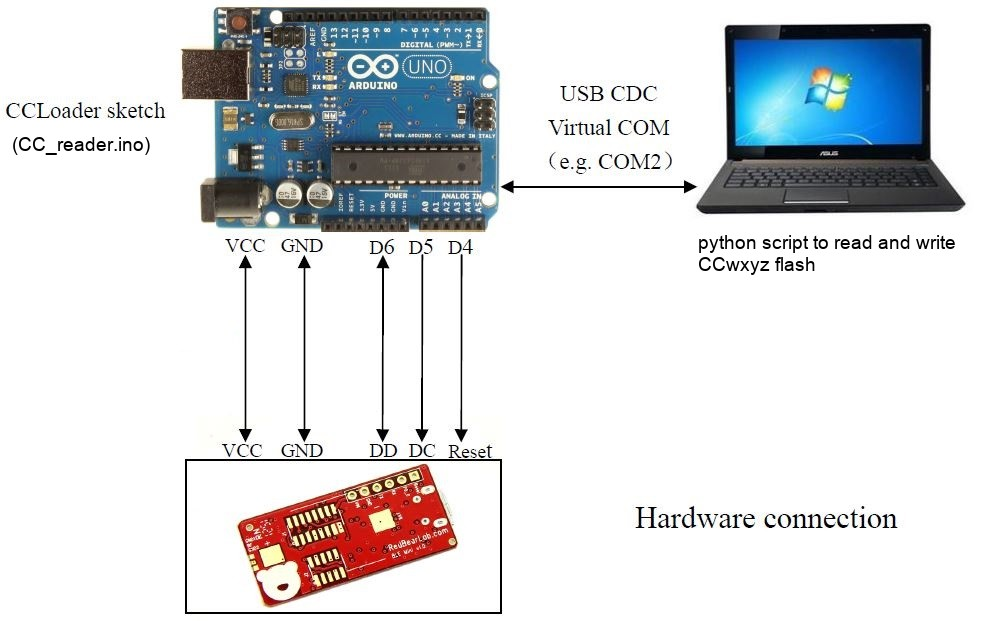

CCLoader
========

Burn CC254x firmware using an Arduino board.

1. Load the Arduino sketch to the UNO board.
2. Wire the pins:
  
3. Use python script to load the binary to the CCwxyz via UNO board
